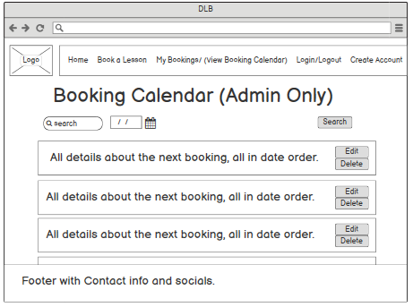

# Driving Lesson Booking

The goal of DLB is to make the act of booking a driving lesson as quick and simple for everyone involved and provide a diary of all booked lessons for students and instructors.

## User Stories
### Instrucor Goals:
 
* As an instructor I want to be able to look up and easily view what lessons I have and when.
* I want to know how to contact my students incase of any changes in bookings.
* I want to be able to delete bookings and personalize my available time slots.


### Customer Goals:

* I want to be able to easily book a lesson.
* I want to be able to see what lessons I have booked.


### My Goals

* An application where you can easily manage the users on it.
* A good looking app that looks clean and professional across all devices.


## Design

* Color scheme:
    The three colors I'm going to use are red, white and grey as these are the colors on 'L plates' that learner drivers have and grey is a professional looking color for the nav bar and footer and works well with the red and white.

* Typography:
     

* Images:
    I'm going to put a hero image of a learner driver and their car on the home page to instantly show visiting users what this website is about.
    Plus I will have the logo at the top of the nav bar on each page.


## Wireframes


### Home


On the home page I wanted the user to instantly know what the app did, so this is why there is a book lesson button a description of what Driving Lesson Booking is. in the final version i also added a big picture of a learner driver to help do this. The login and book buttons are in the middle of the page as theese are the two most important  buttons and what we want the users to do most. There are also review cards to convince the user even more to use our service.


On mobile it is similar but the nav bar is now a side menu trigered by the burger button and the review cards are stacked ontop of each other. In the final version the hero image is stacked ontop of the main text.

### Book Lesson


The booked lesson page is the page that has followed the wire frame the least but it still follows the same idea of keeping the entire booking process on the same page and making it clear and obviouse for the user. Instead of having the calender imbeded in the page. it's a popup in a stepper. the final product looks very clean and not cluttering the page like this wireframe has. 


The wireframe places everything vertically which is what the final version does, but because it's in a stepper it's all compact and you can easily switch between different steps in the booking process.

### Login


I wanted a standard login with a link to create an account if the user didn't have one because you just want the user to login as quickly as possible.

### Register


The register page has one purpose and that's to sign the user up so everything is on that one page and you click sign up and that's it. But it also has a link if the user already has an account.

### View Bookings


The view bookings page is how the student views there bookings but can also cancel them. I originally was going to have the bookings in a colapsible but as ther not that much info in a booking the final version uses [Materialize cards](https://materializecss.com/cards.html) displaying the correct info.

### Booking Calendar



The booking calendar is for instructors to see who they have booked, so it shows there upcoming lessons in order, and also has an edit and cancel button for each booking incase they need to change things. There is also a search function at the top to search for specific bookings.


Edit popup is just a simple form but in the final version you can't change the name of the student of the booking. And ther is also a cancel button in the final version if the user want's to stop editing.


The user manager is an admin only page where they can set account types and eddit user infor, so that needed to be as easy as possible. Users are in collapsibles because there is too much data to fit on a card to look nice and not cluster up the page. so when you click on the wanted user it brings up an edditable form for the admin to change and update. In the final version the edit button makes the form editable otherwise you can only read it to stop mistakes being made, then the submit button writes it to the db.


## Features

* Responsive on all devices
* Nav bar that is a hidden side nav on mobile
* Create account and login validation
* Able to edit user profiles(excluding passwords)
* Able to create, delete and edit bookings
* Have different access levels based on account type.
* Search booking and user features.
* An instructor contact page.


## Technologies Used

### Languages Used

* HTML
* CSS
* JavaScript
* Python

### Frameworks, Libraries and Programs Used:

1. Flask
    * Flask is the framework I used to create my app it depends on the Jinja template engine and the Werkzeug WSGI toolkit.
2. Materialize
    * Materialize was used to help make the website responsive and implement features like select forms and date pickers.
3. jQuery
    * I used this in my js files mainly to help initialise Materialize js features.
4. Font Awesome
    * I used Font Awesome to provide icons for my app.
5. Google Fonts
    * I used google fonts to provide the fonts for my app.
6. Mongo DB
    * The database system I'm using to store all user data and bookings.
7. PyMongo
    * Pymongo was used to help interact with MongoDB through python.
8. Git
    * Used to push all code to github from git pod workspace
9. GitHub
    * Used to store all the code after pushing from git
10. Heroku
    * Used to deploy application to the web.
11. Balsamiq
    * Used to create Wireframes


## Testing

### Instructor Goals Testing:
1. "As an instructor I want to be able to look up and easily view what lessons I have and when."

    All this will be available within the Booking Calendar Page which will show all lessons that the instructor has and can search by date and by student. For convenience the lessons will appear in date order so the instructor can see their next lesson.

2. "I want to know how to contact my students incase of any changes in bookings."

    On the booking calendar page it will show the student and their contact info on the booking card so the instructor can contact them.

3. "I want to be able to delete bookings and personalise my available time slots."

    The ability for both instructors and students to cancel booked lessons is there even with a confirmation popup to avoid mistakes. The ability to personalise time slots though is not yet implemented and for more information please look at the future scope section.


### Student Goals Testing:

1. "I want to be able to easily book a lesson."

    As soon as you make an account it takes you to the home screen which propmts you to book a lesson also it is the second tab in the side bar after home encouraging the user to book a lesson. Once they click on it the user only has to input 3 fields: driving instructor, date, time and an optional 4th of any other information the instructor may need like a pickup location.

2. "I want to be able to see what lessons I have booked."

    The "My Bookings" page clearly shows all bookings and information about the booking to the user, and can be searched by student, instructor or date.


### My Goals Testing:
1. "An application where you can easily manage the users on it."
    I have a fully functioning user manager page where admins can search through the database of users and edit their profiles, excluding passwords, if needed and change account types. For easy use there is a search feature where you can search users by first name, last name and username.

2. "A good looking app that looks nice on both desktop and mobile."

    With the help of Materialize the app looks sleek on desktop, tablet and mobile. I have fully used their grid system throughout development to create a responsive layout.
    I also have used a Materialize stepper which was created by [Floris List](https://codepen.io/flist) which I found on [code pen](https://codepen.io/flist/pen/mqXemY). It is just what I needed, which was a simple form layout which looks great on all screen sizes and keeps you on the same page throughout the whole booking proccess. Originally I had split the booking across two pages so I could load the timeslots with a new page but because of the fetch function I could load in the data without refreshing the page.


### Testing web page

#### Nav Bar and Links

All links in the footer redirect to the correct website on a new tab for the user to view our socials. All links within the website linking with other pages all work correctly and consistently plus correct links show up in the nav bar for who is logged in and there account type. They also all work correctly on mobile and because of the hidden side nav are easily accessibly and look good. 

#### Booking Lessons

The booking lessons form works well all data is successfully written to the data base and if any of the required fields aren't filled in it will flash a message on screen and not write any data to the database. I would have used the required attribute like in the registration and login form but for some reason it didn't work probbably to do fith the code for the stepper but i'm not sure what part so this was my solution.

#### Viewing bookings

Viewing bookings works well, you can only see the bookings you've booked and no one elses it looks neat and clean and you can cancel a booking if you want to and even has a warning popup to avoid unwanted cancelations.

#### Booking callender

The booking callender works well, the instructor can view all lessons that are booked to them, can cancel lessons, edit bookings and can even search through them by name and date.

#### User Manager

The user manager displays all accounts in collapsible elements which inturn let you edit the user. It flash's a message to the user if the booking is made succesfully.
It displays all required information and looks good. Plus there is a search feauturre that allows you to search through the accounts.

#### Create account/ Login

Create account works, it uses the required attribute to force the user into filling out all the fields, it writes the new users details to the databse and hashes the password correctly using `generate_password_hash()` so it is unreadable to someone looking at the database.

#### Instructors Page:

The Instructors page was a late addition as I thought it was a better way for people to be able to contact the instructors than the info appearing on the booking. All it does is loop through the list of instructors passed into the page and display there contact info. In the future i could possibly add a feature which allows the instructor to upload a picture of themselves and then display it next to their info.

#### Responsive design

All pages are designed to look good across all devices using materializes grid system which allows elements to change size and position based on screen size

#### Error Pages/ handling:

To handle errors I used [pythonprogramming.net](https://pythonprogramming.net/flask-error-handling-basics/) to help me out. I created a 404.html page and 500.html page
to link to if an error occured with a very basic message on each and links back to the other pages. The 404 page just says page not found but the 500 page gives a little description of the type of error that occured. Also before each page loads a check is made to see if the user is logged in and the correct account type is logged in to view the page so people can't manually type in restricted pages.

Restriction code:
```
    if not is_user_logged_in():
        return redirect(url_for("login"))

    if get_user_account_type() != 'admin':
        return redirect(url_for('home'))
```


### Other teting:

* Testing sidenav:

    The sidenav that is used so mobile users can access the menu wasn't working. This was because jquery wasn't connected so I added it to the base.html and that fixed it.

* Passing data using fetch:

    I started off using session to store data and make it available on the html page. Now I am calling the python function via a js fetch call. I had a problem where the call was returning the event data and not the time slot data I wanted so using the .json() function I managed to extract the correct data and injected it into my select input as options using .innerHTML.

``` javascript  
    async function getAvailableSlots(_eventdata, instructor = $("#instructor-selector").val(), date = $('#lesson-booking-date-picker').val()) {

        response = await fetch(`/get_available_slots?date=${date}&instructor=${instructor}`)
        response.json().then(data => {
            slots = data.slots
            let timeSlotsHTML = `<option value="" disabled selected>Choose Time Slot</option>`;
            for (slot in slots) {
                timeSlotsHTML += `<option value="${slots[slot]}">${slots[slot]}</option>`
            }
            document.getElementById('time-selector').innerHTML = timeSlotsHTML;
        })
    }
```

* NoneType error thrown after creating an account:

    When an account is created it writes the accoun_type to the db but it didn't write it quick enough and it was getting looked up when `get_account_type()` is called when rendering the home page. To get around this I render the login page making the user login again which gives enough time for the account to be written to the db and then be called after the user has logged in.

* Date Formatting:

    I originally wrote the date as a string because I wanted the date in dd/mm/yyyy format as that is the way the standard in the UK making it more user friendly but it made sorting and searching difficult. So I changed it to `datetime.datetime` type as this is how mongo store their dates so when a booking is made it gies through this `datetime.strptime(request.form.get("date"), "%d/%m/%Y")` which puts it in to the correct format for mongo. However it messes up the more user friendly format I wanted. So this was my solution.

    ```
        def date_format(e):
        year = e.strftime("%Y")
        month = e.strftime("%m")
        day = e.strftime("%d")
        new_date = "{}/{}/{}".format(day, month, year)
        return new_date
    ```

    It strips the month day and year from the `datetime.datetime` object and then formats a string out of them which is returned and can be used. having the dat stored this way made sorting on the booking calendar and view booking page alot easier, however it didn't allow me to create an index that searched for both text and date in the documents so I will have to look for another way to search by date.


* Date Sorting:

    Sorting the date was difficult as i needed to seperate the lessons that were on dates in the past that have already happened from ones that are coming in the future.
    This was my solution.
    ```
        def sort_booking_list(bookings):

        completed_lessons = []

        for booking in reversed(bookings):
            if booking['lesson_completed']:
                completed_lesson = booking.copy()
                completed_lessons.append(completed_lesson)
                bookings.remove(booking)


        for completed_lesson in completed_lessons:
            bookings.append(completed_lesson)

        return bookings
    ```
    This function will take in a list of the bookings that has been sorted by date already by using `.sort('date')` it then checks the bookings if `'lesson_completed' == True` on the booking and adds it to the completed_lessons list and removes it from the bookings list. At first i was having trouble as when you remove something from a list it resets the position of all the bookings in the list meening it would skip over every other booking and not check if it was completed. luckily I found the solution on [this Stack Overflow page](https://stackoverflow.com/questions/14267722/python-list-remove-skips-next-element-in-list) saying that if you used `reversed()` you can skip over this problem because you start itterating from the end so any bookings that are left to be changed don't change list position.


## Deployment

This is how I deployed my project to Github and Heroku

1. First of all I created a github repository using Code institutes github-full-template on git pod.

2. I then created my base files and installed required packages that I needed such as flask. 

3. One of these files was the env.py file which has sensitive data that I didn't want uploaded to git such as my mongo db login and secret key. so I created a .gitignore file and put the env.py file and pycache in so they didn't get uploaded to github.

4. I then wrote in the terminal `git add -a`, `git commit` and then `git push` to push it to my github repository

5.  Next in the terminal I created requirements.txt by typing `pip3 freeze --local > requirements.txt` this tells heroku which apps and dependencies are needed to run the app.

6. Then I created a procfile by typing `echo web: python app.py > Procfile` into the terminal, this tells heroku which file runs the app. I then pushed to github again.

7. I then went to [Heroku.com](https://dashboard.heroku.com/apps) logged in and clicked new and then create a new app.

8. I then named my app with a unique name and selected Europe as my region then created app.

9. I then went to the deploy tab of my app then selected connect to GitHub, I entered the git hub repository name and then search and clicked on my app.

10. Then I clicked on settings selected reveal config variables and inputted all the variables I have in my env.py file.

11. Then back on the deploy tab I clicked enable automatic deployment and then hit deploy branch. You know it's worked when it says "Your App was successfully deployed.".

12. Now it automatically updates when we push to github.


### Note:

At the start of my project I was pushing straight to Heroku using the cli commands 

```
    $ git add .
    $ git commit -am "make it better"
    $ git push heroku master
```

This meant that I was not saving to github and not saving my commit messages either. When I realised this I switched back to the way I layed out above. I realised this when git pod went down and I lost my workspace and nothing I had done since the initial commit was saved to github. Luckily I managed to clone the repository using 
`heroku git:clone -a myapp` command and didn't lose much work.


## Photos links

* Hero Image used on the home page was from [unionschoolofmotoring](https://www.unionschoolofmotoring.co.uk/wp-content/uploads/2020/10/prices-car.png.webp)

* The L plate used in the nav bar was taken from [passmefast](https://blog.passmefast.co.uk/images/l-plate-300x300.png)


## Code links

* The Stepper I used in my booking form was created by [Floris List](https://codepen.io/flist/pens/) on [codepen](https://codepen.io/flist/pen/mqXemY) It came with prewritten html, js and css files that I have adapted for my needs.

* I have used lots of official documentation and websites to help me throughout my project:
    * [w3schools](https://www.w3schools.com/) - I used to help me for using Python to interact with mongo db
    * [Mozilla](https://developer.mozilla.org/en-US/docs/Web) - I used this for helping me with the code that fetches the available time slots and also selecting elements with 'disabled' attributes.
    * [MongoDB docs](https://docs.mongodb.com/) - I used Mongo db to help set up my data base and also accessing it through my app.
    * [Flask](https://flask.palletsprojects.com/en/2.0.x/) - If I had anything that I was stuck on in my app.py file I usually referred to this.
    * [Jinja](https://jinja.palletsprojects.com/en/3.0.x/) - I used Jinja docs to help set up templates and more specifically filtering within the templates.
    * [Materialize](https://materializecss.com/) - Materialize was what I used to style the whole app so if I had any problems styling I used their official docs.
